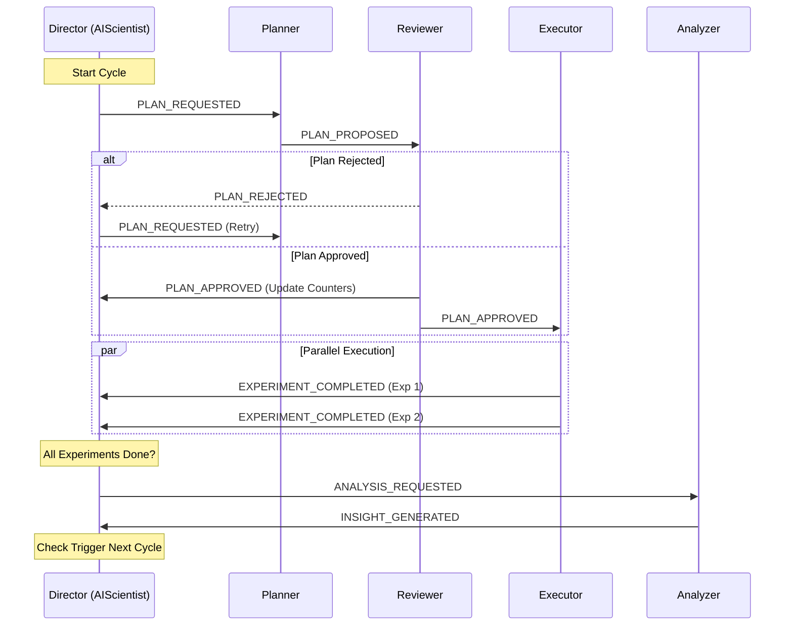

# AI Scientist for SCI (v3.0)

System for automated scientific discovery using Large Language Models (LLMs). This project implements an agentic loop where multiple AI agents collaborate to plan, execute, analyze, and refine experiments in the SCI (likely Scientific Computational Imaging or similar) domain.

## Project Overview

The **AI Scientist** acts as a "Research Director" orchestrating a team of specialized agents:

- **Planner Agent**: Generates new experiment configurations based on previous results and exploration strategies.
- **Reviewer Agent**: Validates and critiques proposed experiment plans.
- **Executor Agent**: Runs experiments (supports both simulation/mock mode and actual execution).
- **Analysis Agent**: Analyzes experiment results, identifies Pareto-optimal solutions, and generates finding/insights.
- **World Model**: A database-backed system that maintains the state of all experiments and their results.

The system supports both **Asynchronous (Event-Driven)** and **Synchronous** execution modes.

## features

- **Multi-Agent Architecture**: Collaborative agents communicating via a central Message Bus.
- **Event-Driven Loop**: Asynchronous workflow allows for parallel experiment execution and analysis.
- **Pareto Engineering**: Focuses on finding Pareto-optimal configurations across multiple objectives (e.g., performance vs. cost/complexity).
- **LLM-Powered**: Uses LLMs (like GPT-4) for reasoning in planning and analysis.
- **Design Space Exploration**: Automatically explores hyperparameter spaces defined in configuration.

## Project Structure

```
├── config/                 # Configuration files
│   └── default.yaml        # Default settings for agents, synthesis, and experiments
├── src/                    # Source code
│   ├── agents/             # Agent implementations
│   │   ├── base.py         # Base agent class
│   │   └── sci/            # Domain-specific agents
│   │       ├── planner.py      # Experiment planning logic
│   │       ├── executor.py     # Experiment execution logic
│   │       ├── analysis.py     # Result analysis and insight generation
│   │       ├── reviewer.py     # Plan review and validation
│   │       ├── world_model.py  # Data storage and retrieval
│   │       └── structures.py   # Data structures
│   ├── core/               # Core framework components
│   │   ├── scientist.py    # Main orchestration loop (Director)
│   │   ├── bus.py          # Message bus for event handling
│   │   └── world_model_base.py
│   └── llm/                # LLM client wrappers and utilities
├── sci_loop.py             # Main entry point script
├── mock_service.py         # Mock service for simulation
├── pyproject.toml          # Project dependencies and metadata
└── uv.lock                 # Dependency lock file
```

## Event Flow (Architecture)

The system uses an **Event-Driven Architecture (EDA)** with a `MessageBus` for asynchronous agent communication.

### 1. Planning Phase
*   **Trigger**: `Director` starts a new research cycle.
*   **Action**:
    1.  **Director** publishes `PLAN_REQUESTED`.
    2.  **PlannerAgent** receives the request, queries the `WorldModel` for history/context, and uses LLM to generate new experiment configurations.
    3.  **PlannerAgent** publishes `PLAN_PROPOSED`.

### 2. Review Phase
*   **Trigger**: `PLAN_PROPOSED` event.
*   **Action**:
    1.  **ReviewerAgent** validates the proposed plan (rule-based checks + LLM safety/strategy review).
    2.  If **Approved**: Publishes `PLAN_APPROVED` with the valid configs.
    3.  If **Rejected**: Publishes `PLAN_REJECTED` (Director may retry planning).

### 3. Execution Phase
*   **Trigger**: `PLAN_APPROVED` event.
*   **Action**:
    1.  **ExecutorAgent** submits experiments to the SCI Service (or runs them in Mock mode).
    2.  Experiments run in parallel/async.
    3.  As each experiment finishes, **ExecutorAgent** publishes `EXPERIMENT_COMPLETED`.

### 4. Monitoring & Analysis Phase
*   **Trigger**: `EXPERIMENT_COMPLETED` events.
*   **Action**:
    1.  **Director** tracks progress. When all planned experiments for the cycle are done, it publishes `ANALYSIS_REQUESTED`.
    2.  **AnalysisAgent** analyzes the new results, identifying the Pareto Front and generating trends/insights using LLM.
    3.  **AnalysisAgent** publishes `INSIGHT_GENERATED`.

### 5. Decision Phase
*   **Trigger**: `INSIGHT_GENERATED` event.
*   **Action**:
    1.  **Director** saves insights to the `WorldModel`.
    2.  Checks budget and cycle limits.
    3.  If resources remain, it triggers the **next cycle** (Go to Step 1).
    4.  Otherwise, it terminates the loop.



## Installation

This project uses modern Python packaging. Ensure you have Python 3.9+ installed.

1.  **Clone the repository**
2.  **Install dependencies**:
    It is recommended to use a virtual environment.

    ```bash
    pip install -e .
    # OR if using uv
    uv sync
    ```

3.  **Environment Setup**:
    Create a `.env` file in the root directory with your API keys:

    ```env
    OPENAI_API_KEY=your_api_key_here
    ```

## Usage

To run the AI Scientist loop:

```bash
python sci_loop.py [options]
```

### Options

- `--config`: Path to configuration file (default: `config/default.yaml`)
- `--mock`: Run in mock mode (simulates experiments without real execution).
- `--budget`: Set the maximum number of experiments to run.
- `--cycles`: Set the maximum number of research cycles.

### Example

Run with default settings (mock mode):
```bash
python sci_loop.py --mock
```

Run with specific budget:
```bash
python sci_loop.py --budget 50 --cycles 10
```

## Configuration

The standard configuration is located in `config/default.yaml`. You can customize:
- **Design Space**: The parameters and ranges to explore (e.g., `compression_ratios`, `learning_rates`).
- **LLM Settings**: Model selection and API base URLs.
- **Experiment Settings**: Budget caps and cycle limits.

## License

MIT
